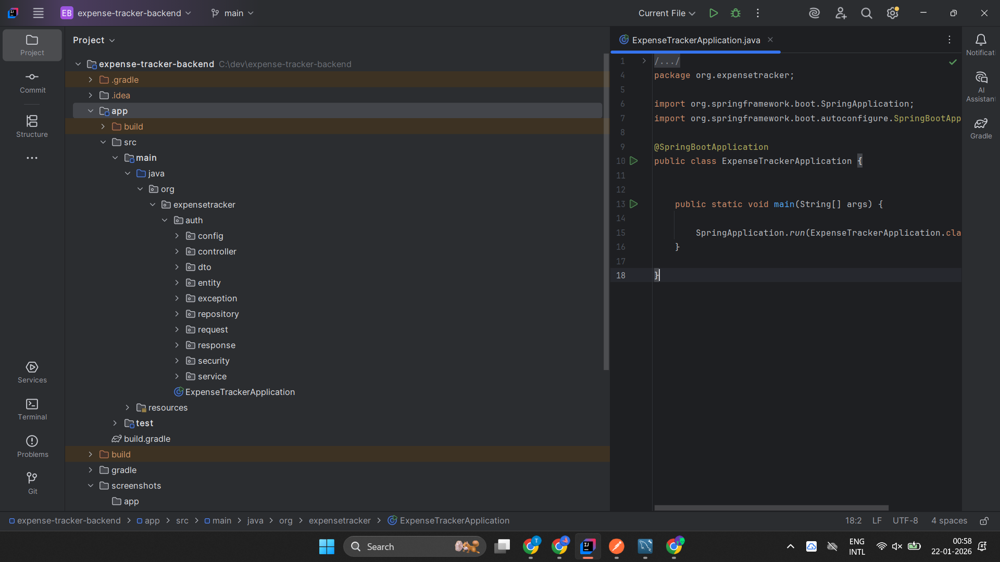
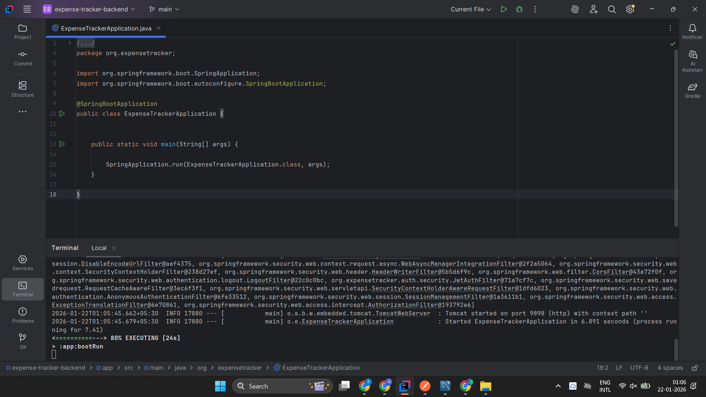
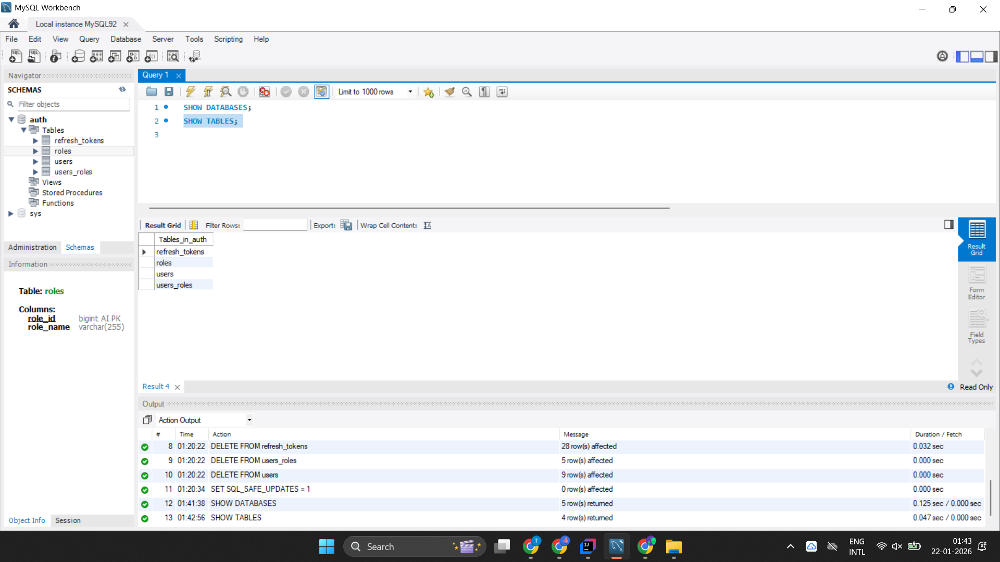
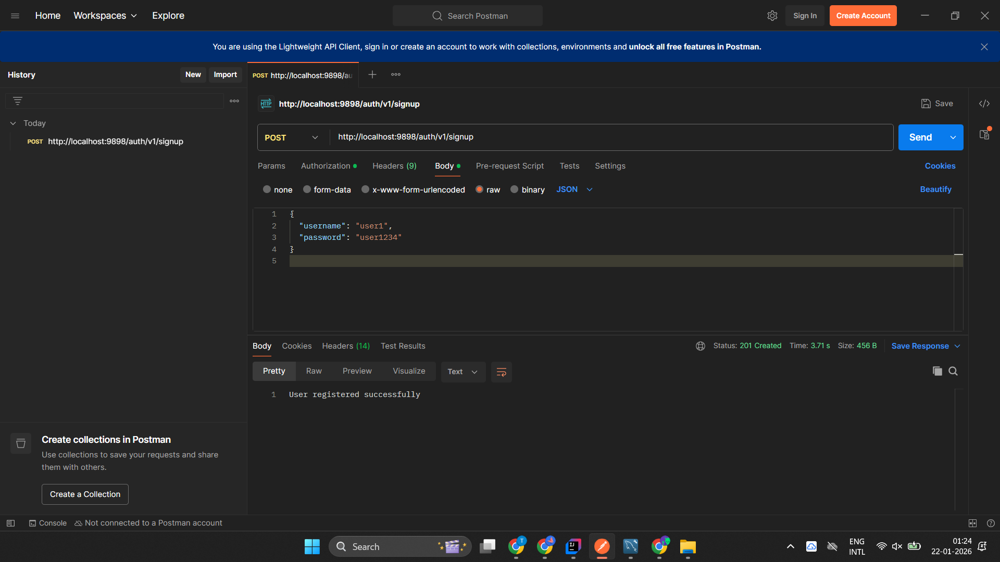
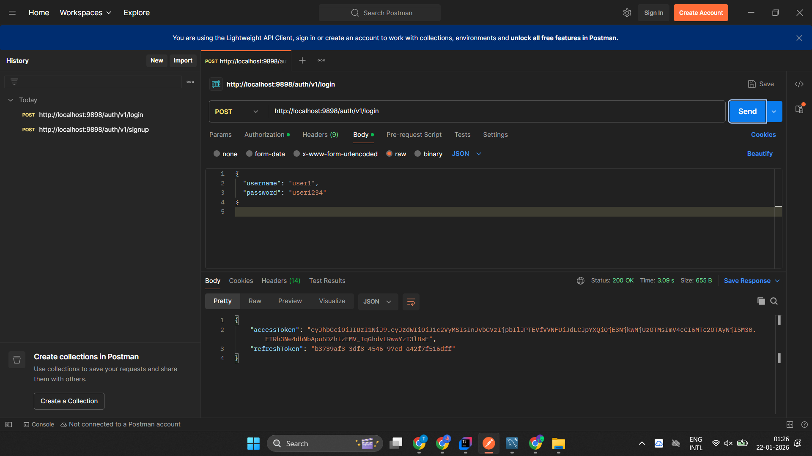
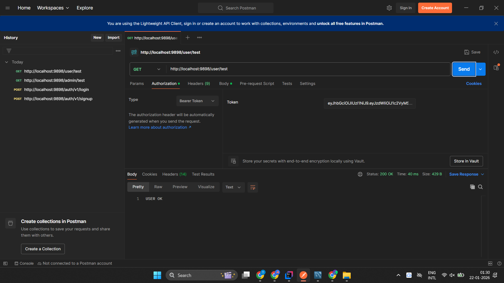
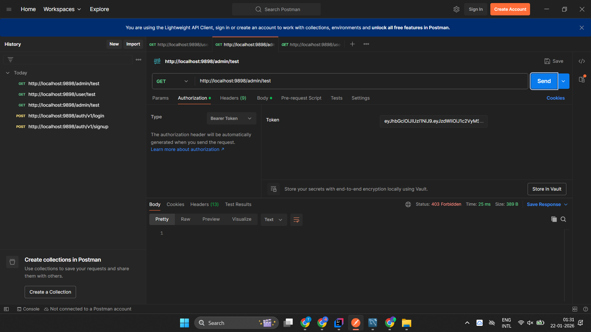

# 🔐 Secure Expense Manager – Authentication Service

## 📌 Overview
This project implements a **secure Authentication and Authorization service** using **Spring Boot**, **Spring Security**, **JWT**, and **MySQL**.

It handles **user signup, login, role-based authorization**, and **refresh token–based session management**.  
The service is designed following **layered architecture** and is tested using **Postman**.

---

## 🚀 Features
- User Registration & Login
- Password Encryption using BCrypt
- JWT Authentication (Access Token + Refresh Token)
- Refresh Token stored in Database
- Role-based Authorization (USER / ADMIN)
- Secure REST APIs using Spring Security
- MySQL Database Integration
- Stateless Authentication

---

## 🧰 Tech Stack
- Java 21
- Spring Boot 3
- Spring Security
- JWT
- MySQL
- Hibernate / JPA
- Gradle
- Postman (for API testing)

---

## 📂 Project Structure



The project follows a **layered architecture**

---

## 🔐 Authentication & Authorization Flow

1. User signs up with username and password
2. Password is encrypted using **BCrypt**
3. User logs in and receives:
    - JWT Access Token (short-lived)
    - Refresh Token (stored in DB)
4. Client sends JWT in Authorization header for secured requests
5. `JwtAuthFilter` validates token and sets `SecurityContext`
6. Role-based access is enforced using Spring Security


---

## 🔑 API Endpoints

| Method | Endpoint       | Description |
|------|----------------|-------------|
| POST | `/auth/v1/signup` | Register new user |
| POST | `/auth/v1/login` | Login and get tokens |
| POST | `/auth/v1/refresh` | Refresh access token |
| GET | `/user/test`   | Secured user API |
| GET | `/admin/test`  | Admin-only API |

---

## 🔐 Authorization Header

All secured APIs require JWT token in header:

```http
Authorization: Bearer <access_token>
```


## ▶️ Application Running



The application runs on **embedded Tomcat** and exposes secured REST APIs.


---

## 🗄️ Database Design



### Tables Used
- `users` 
- `roles` 
- `refresh_token` 
- `user_role_mapping`

Refresh tokens are persisted to allow **secure token renewal and session control**.


---

## 🧪 API Testing (Postman)

### User Signup


### Login (JWT + Refresh Token)


### Authorized User Access


### Unauthorized Admin Access



---

## ▶️ How to Run the Application

### Prerequisites
- Java 21 installed
- MySQL running
- Gradle (or use Gradle Wrapper)
- Postman (for API testing)

### Database Setup
Create a MySQL database:

```sql
CREATE DATABASE auth;
```

### Run the Application
```bash
./gradlew bootRun
```

## 📌 Upcoming Features
- Expense Management Module (CRUD APIs)
- Budget Tracking & Category Management
- User Profile & Settings APIs
- Logout & Refresh Token Revocation
- Role-Based Permission Enhancements
- Docker Containerization (Planned)
- Deployment on Cloud Platform (Planned)

